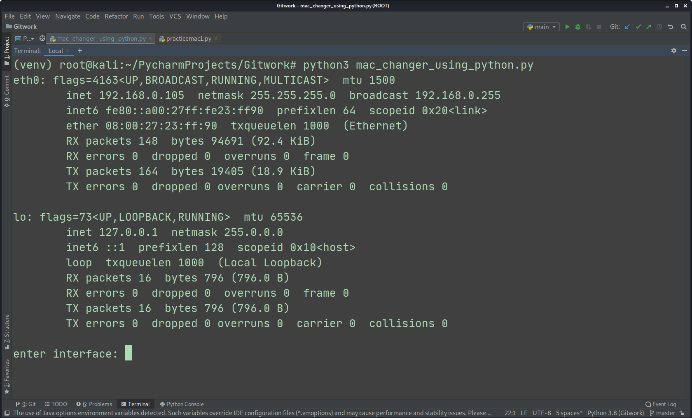
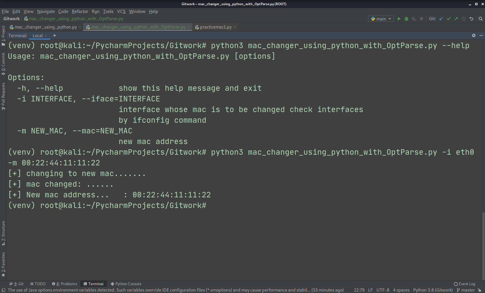

# mac_address_changer_using_python
mac address changer using python (without optparse)
module used are 
1-subprocess
2-re(regular expression)

# mac address changer similar to first but  using optparse this time

